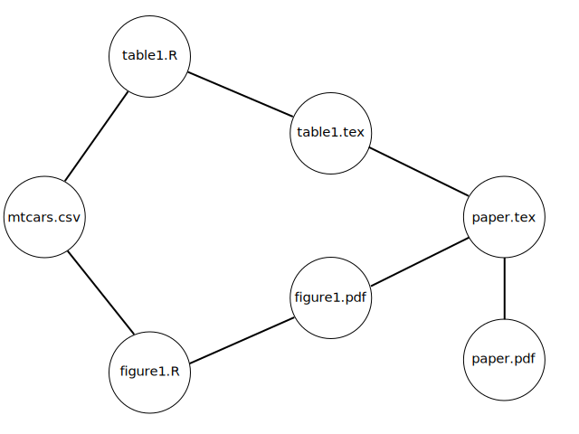

# Example of `make` for data analysis

This repository shows how to use `make` for a data analysis project.

The paper (PDF) is generated from a LaTeX source file, a table, and a figure.

`make` uses a set of instructions in `makefile` to generate the table and figure using R code and a datafile, and then generate the PDF from the manuscript.

`make` is clever because it deconstructs each part of the analysis so that only parts that have changed need to be rerun. If the data change, everything is rerun. If figure-generating code changes, only that code and the manuscript are rerun. If only the manuscript changes, only `pdflatex` is rerun. It's smart like that.

Basically it works on a directed acyclic graph (DAG) model, sort of represented by this figure:

The R file `analysis.R` shows what is going on in `makefile` using possibly more familiar R syntax.

Zach Jones has [a good tutorial](http://zmjones.com/make/) about all of this.
